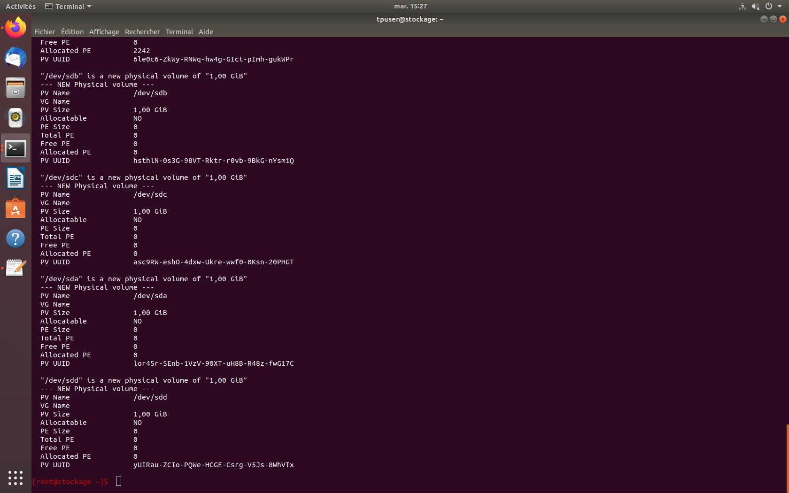
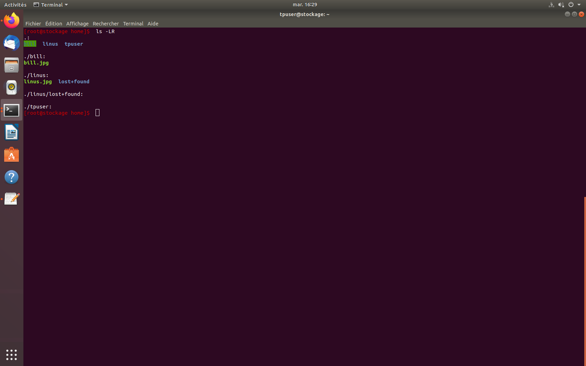

# Réseaux et Stockages Distribués

## Configuration

Afin de pouvoir accéder à la machine virutelle distante, il faut d'abord y établir une route. Pour cela on change le gateway par défaut à celui fournit (`10.192.12.1`) puis on définit la route de la machine virtuelle depuis le gateway. Pour cela on utilise les commandes suivantes sur la machine locale:

```bash
sudo route add -host 10.192.12.1 dev eno1
sudo route add -net 192.168.201.0/24 gw 10.192.12.1
```

Une fois connecté, on peut changer d'utilisateur (root) en utilisant la commande suivante. Toutes les commandes qui sont listées dans ce rapport seront exécutées sous cet utilisateur.

```bash
su - root
```

## Configuration des disques

1. À l’aide de `fdisk -l` identifiez les disques durs de la machine (n’hésitez pas à lire le manuel et à utiliser l’aide de `fdisk`) puis observez avec fdisk */dev/\<identifiant du disque\>*.

En utilisant `fdisk -l` on peut voir les partions utilisés par la machine virtuelle. On observe alors 5 disques différents (ici virutels) à savoir:

- */dev/sda*
- */dev/sdb*
- */dev/sdc*
- */dev/sdd*
- */dev/vda* (ce dernier semble contenir l'OS de la machine virtuelle, on n'y touchera pas)


On peut aussi utiliser la commande `lsblk` qui permet de lister les périphériques blocs.

1. Décrivez les partitions de vos disques et l’organisation des systèmes de fichiers (vous pouvez vous aider de la commande `df`)

La commande `df` utilisée sans aucun arguement permet d'afficher l'espace disponible sur les sytèmes de fichiers montés. Si on lui spécifie des fichiers en paramètres, il va afficher l'espace disponible sur le système de fichiers contenant chaque fichier passé en paramètres.

En utilisant la commande `df -h` (l'option h permet d'obtenir un résultat plus lisible) on obtient le résultat suivant:


Grace à cela on peut donc constater que le système de fichier */dev/mapper/tpStockage-root* à une capacité totale de **8.4Go** en tout dont **5.5Go** sont utilisés et **2.6Go** sont libres (soit **68%** utilisés). Elle est également montée sur */*. On peut appliquer le meme principe pour chaque ligne.

On observe aussi les systèmes de fichier présents sur la machine virutelle.

1. Toujours avec fdisk, si nécessaire, détruisez la/les partitions éventuellement existantes et créez en 2 de taille à peu près égales de type Linux LVM en utilisant la totalité de l’espacedisponible sur chacun des disques. Indiquez les commandes que vous utilisez en expliquant la syntaxe

Si on doit effacer des partitions existantes on utilise la commande `fdisk <nomDuDisque>`, dans notre cas `fdisk /dev/sda` par exemple. On peut ensuite afficher un menu en entrant "m". Si on veut supprimer les partitions on entre "d" puis "q". On répète l'opération pour chaque disque qui le nécessite.

## Configuration des volumes

Ensuite on va créer deux partitions **LVM** qui seront composée chacune de deux disques. Ceci va se dérouler en trois étapes principales à savoir:

- Créer des volumes physiques
- Créer des groupes de volumes
- Créer des volumes logiques

Pour commencer nous alons créer les volumes physiques. Pour cela nous allons utiliser la commande suivante:

```bash
pvcreate /dev/sda /dev/sdb /dev/sdc /dev/sdd
```

On peut ensuite lister les volumes physiques présents en utilisant la commande `pvdisplay`.



Ensuite on créé un groupe de volume qui contient les quatres disques. Pour cela on utilise la commande `vgcreate` afin de créer le groupe de volume.

```bash
vgcreate <volumeName> /dev/sda /dev/sdb /dev/sdc /dev/sdd
```

On aurait aussi pu utiliser la commande comme suit

```bash
vgcreate <volumeName> /dev/sda
```

Puis la commande suivante afin d'étendre le groupe de volume:

```bash
vgextend <volumeName> /dev/sdb
```

On peut ensuite afficher les différents groupes de volumes en utilisant la commande vgdisplay.

Ensuite on va créer les deux volumes logiques d'une taille à peu près égale (dans notre cas **2Go**). Pour cela on utilise la commande suivante:

```bash
lvcreate -L2000 -n <logical volume name> <volume group name>
```

Dans notre cas:

```bash
lvcreate -L2000 -nlvm1 volumeGroup
lvcreate -L2000 -nlvm2 volumeGroup
```

On obtient donc deux volumes logiques nommés respectivement *lvm1* et *lvm2*. On peut vérifier leur existance en utilisant la commande suivante:

```bash
lvscan
```


On observe nos deux volumes logiques créé chacun d'une taille de **1.92Go**.

## Création des systèmes de fichiers

1. Créez un système de fichier *ext4* pour l'utilisateur linus

Afin de créer un système de fichier pour un utilisateur on va d'abord formater *lvm1* en *ext4* (qui va appartenir à linus) en utilisant la commande `mkfs`:

```bash
mkfs -t ext4 /dev/volumeGroup/lvm1
```

2. Créez un système de fichier *ntfs* pour l'utilisateur bill

On procède de la meme manière que pour linus mais cette fois on va formater le volume *lvm2* en *ntfs* avec cette commande:

```bash
mkfs -t ntfs /dev/volumeGroup/lvm2 
```


3. Montez les systèmes de fichiers en bonne place dans l’arborescence et créez les utilisateurs (`mount` et `adduser`)

Avant de créer les utilisateur on va monter les systèmes de fichiers avec la commande `mount`. On va monter les systèmes de fichiers sur */home* dans l'arborescence de la machine virtuelle. Chaque utilisateur aura donc un répertoire */home/linus* (*lvm1*) */home/bill* (*lvm2*). On créé donc les dossiers en utilisant la commande `mkdir` puis on monte les systèmes de fichiers avec les commandes suivantes:

```bash
useradd -d /home/linus linus
useradd -d /home/bill bill
```

Ensuite on va créer les nouveaux utilisateurs qui correspondent avec les commandes suivantes:

```bash
useradd -d /home/linus linus
useradd -d /home/bill bill
```

On va ensuite créer des mot de passe pour chaque utilisateur.

| username | password |
| -------- | -------- |
| linus    | linus    |
| bill     | bill     |

```bash
passwd linus
passwd bill
```

4. Copiez des données quelconques dans ces répertoires.

On utilise la commande `scp` depuis la machine locale afin de copier des données dans les partions précédement créées. On vérifie la présence des données en utilisant la commande `ls -l` dans chaque dossier des utilisateurs.



Afin de vérifier la configuration on utilise la commande `lsblk`. On voit donc bien que les disque */dev/sda* et */dev/sdb* font bien partie du meme volume logique et sont bien montés sur */home/linus*. La meme chose est observable pour */dev/sdc* et */dev/sdd* monté sur */home/bill*.


## Extension des systèmes de fichiers

1. Étendez le groupe de volumes avec les volumes inutilisés (`vgextend`).

Etant donné que nous avons utilisé la totalité des disques lors de la création des groupes de volumes, on peut sauter cette étape, cependant il nous aurait fallut utiliser la commande `vgextend` comme spécifié dans la partie de création des groupe de volumes.

2. Étendez les volumes logiques (`lvextend` ou `lvresize`) de façon égalitaire en utilisant la moitié de l’espace disponible.

Cette étape à déjà étée effectuée dans une partie précédente, mais en partant du principe que cela n'as pas été fait on va donc d'abord démonter les deux volumes comme suit:

```bash
umount /home/linus
umount /home/bill
```

Puis on étend les volumes logiques puis les systèmes de fichiers en utilisant les commandes suivantes:

```bash
lvextend -L 1500 /dev/volumeGroup/lvm1
lvextend -L 1500 /dev/volumeGroup/lvm2
```

3. Étendez les systèmes de fichiers pour que linus et bill puissent utiliser ce nouvel espace (`resize2fs` éventuellement, `ntfsresize`).

Puis on étend les systèmes de fichiers avec les commandes suivantes:

```bash
resize2fs /dev/volumeGroup/lvm1 # par défaut resize2fs prend toute la place possible si aucune taille n'est donnée (ici 1.5Go)
ntfsresize --size 1500 /dev/volumeGroupe/lvm2
```

Ensuite on n'a plus qu'à remonter les volumes à leur ancienne place.